<div align="center">

# 🧠 QuizSphere — Microservices-Based Quiz Platform

### Service Discovery • API Gateway • OpenFeign • PostgreSQL • Independent Domain Services


<br/>


<br/><br/>

<a href="https://github.com/ashrithBalaji456/Quiz-MicroServices">View Complete Monorepo</a>

</div>

---

## 📌 Project Overview

**QuizSphere** is a backend-focused quiz application built using a microservices architecture. The system separates quiz orchestration from question management and places Spring Cloud infrastructure around those domain services.

The project demonstrates a complete distributed request path:

> **Client → API Gateway → Eureka Discovery → Quiz Service → OpenFeign → Question Service → PostgreSQL → Aggregated Quiz Response**

The repository uses a **monorepo structure**, keeping independently runnable Spring Boot applications and the frontend together so the complete architecture can be studied from one place.

The system contains:

- **API Gateway** — the public entry point and route layer.
- **Eureka Server** — service registration and discovery.
- **Quiz Service** — quiz creation and quiz orchestration.
- **Question Service** — question-bank management and question-related operations.
- **React + Vite Frontend** — a lightweight client for interacting with the distributed backend.

---

## 🎯 Architecture Goals

This project was designed to demonstrate:

- separation of business domains,
- independently runnable services,
- service registration,
- logical service-name routing,
- centralized API entry,
- synchronous service-to-service communication,
- database-backed domain services,
- aggregation of data from another microservice,
- and clear boundaries between quiz orchestration and question ownership.

---

## 🧩 Services at a Glance

| Service | Responsibility | Key Technology |
|---|---|---|
| 🔎 Eureka Server | Registers and discovers service instances | Spring Cloud Netflix Eureka |
| 🚪 API Gateway | Central entry point and load-balanced routing | Spring Cloud Gateway |
| 🧠 Quiz Service | Creates quizzes and orchestrates quiz workflows | Spring Boot, JPA, OpenFeign |
| ❓ Question Service | Owns and manages question data | Spring Boot, JPA, PostgreSQL |
| 🎨 Frontend | User interaction with backend workflows | React, Vite |

---

## 🏗️ High-Level Architecture

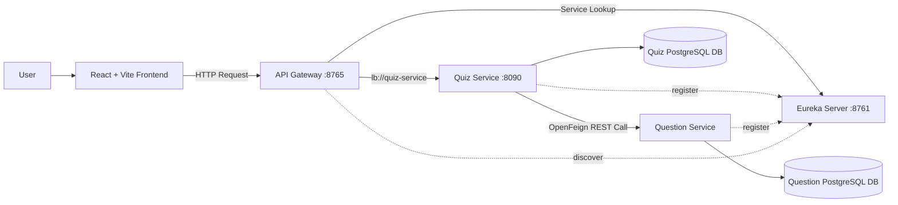

The gateway currently exposes the Quiz Service through the `/quiz-service/**` route, strips the first path segment, and forwards requests using the load-balanced logical URI `lb://quiz-service`.

---

## 🔄 Complete End-to-End Workflow

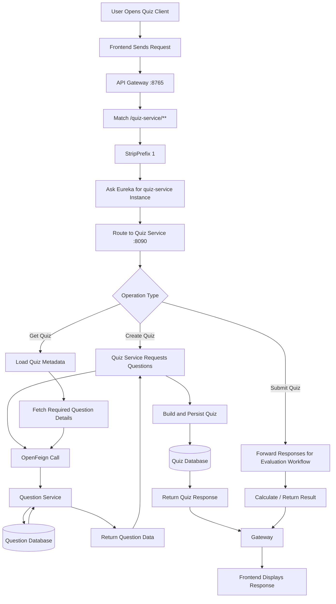

---

## 🚪 API Gateway Deep Dive

The API Gateway is the central public entry point for backend requests.

Verified gateway configuration:

```properties
spring.application.name=api-gateway
server.port=8765

eureka.client.service-url.defaultZone=http://localhost:8761/eureka

spring.cloud.gateway.routes[0].id=quiz-service
spring.cloud.gateway.routes[0].uri=lb://quiz-service
spring.cloud.gateway.routes[0].predicates[0]=Path=/quiz-service/**
spring.cloud.gateway.routes[0].filters[0]=StripPrefix=1
```

### Route Transformation

```text
Client Request
GET http://localhost:8765/quiz-service/quiz/1

                ↓ Path Predicate

Matches /quiz-service/**

                ↓ StripPrefix=1

/quiz/1

                ↓ Eureka + Load Balancer

quiz-service instance

                ↓

GET http://<resolved-quiz-service>/quiz/1
```

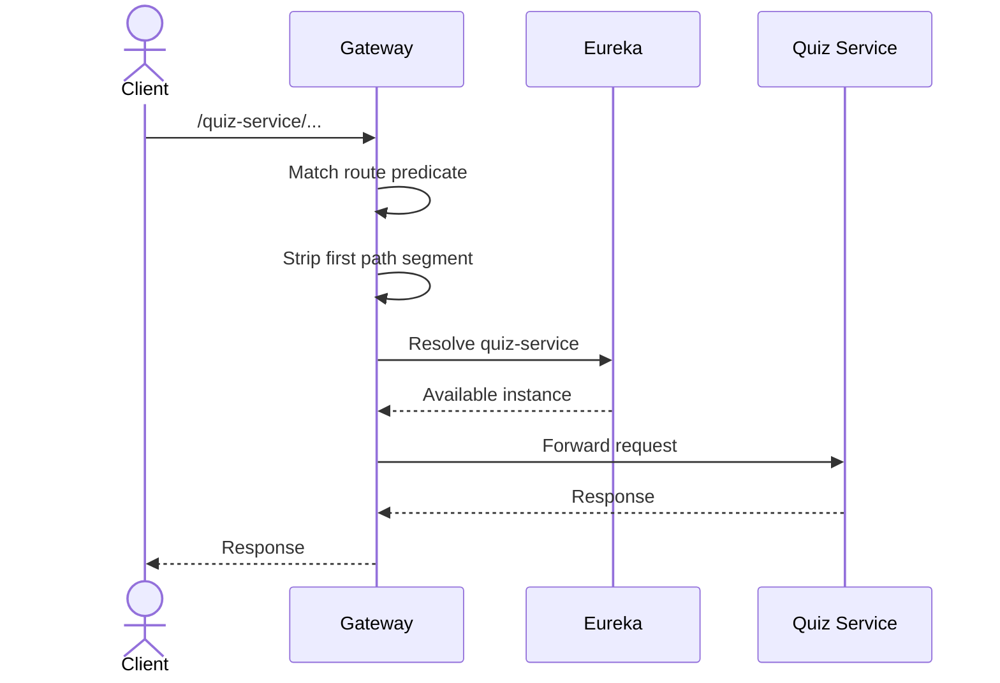

### Why `lb://quiz-service`?

The gateway does not need a hardcoded Quiz Service host and port. It uses the registered service name, allowing service locations to change without rewriting the client-facing URL.

---

## 🔎 Eureka Service Discovery Workflow

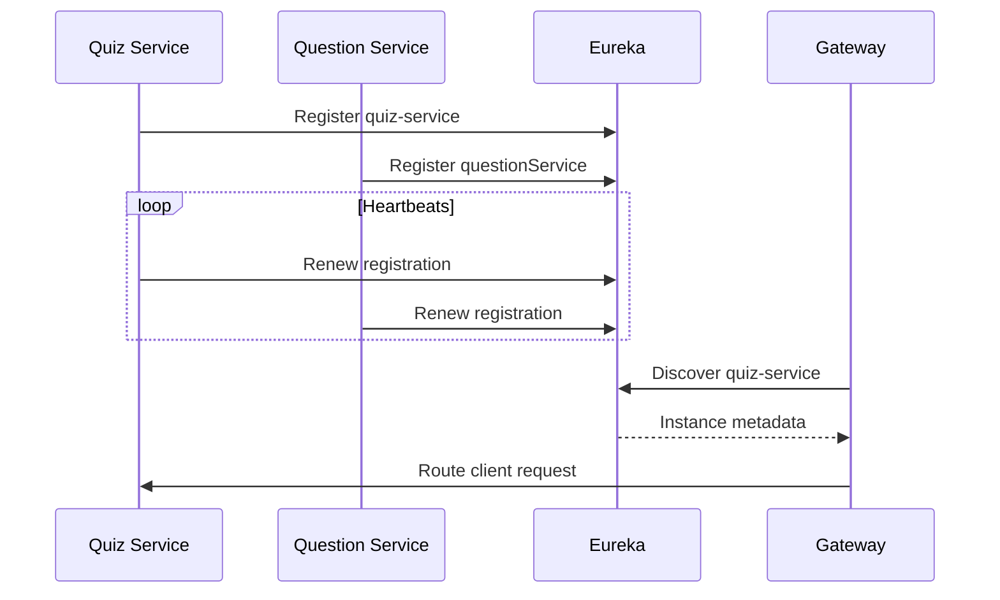

### Why Service Discovery Matters

Without discovery:

```text
Gateway → http://localhost:8090
Quiz Service → http://localhost:<question-port>
```

With discovery:

```text
Gateway → lb://quiz-service
Quiz Service → logical Question Service client
```

This removes infrastructure addresses from business workflows and makes the architecture easier to scale or relocate.

---

## 🧠 Quiz Service Deep Dive

The Quiz Service is the orchestration layer for quiz workflows.

Its verified dependencies include:

- Spring Data JPA,
- Spring Web,
- Eureka Client,
- OpenFeign,
- PostgreSQL driver,
- Lombok,
- Spring Boot testing support.

The service is configured as:

```properties
spring.application.name=quiz-service
server.port=8090
spring.datasource.url=jdbc:postgresql://localhost:5432/quizdb
spring.jpa.hibernate.ddl-auto=update
```

### Quiz Service Responsibilities

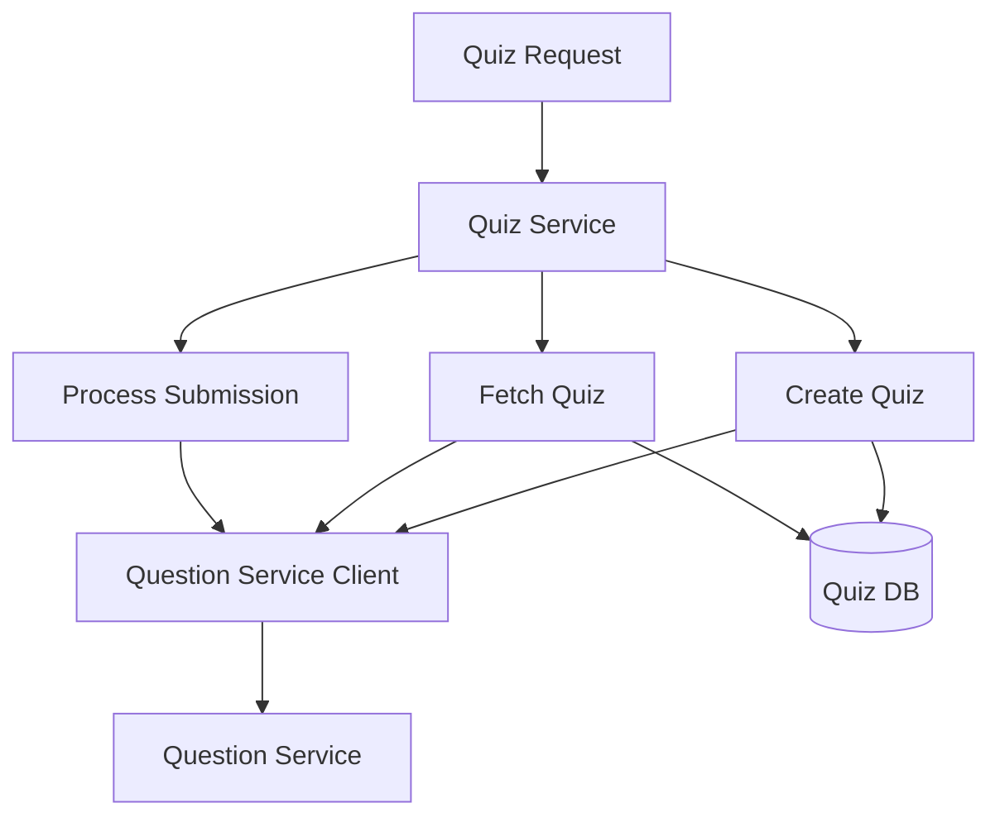

The important architectural idea is that the Quiz Service orchestrates the quiz use case without becoming the owner of the question bank.

---

## ❓ Question Service Deep Dive

The Question Service is the domain owner for question data.

Its verified dependencies include:

- Spring Data JPA,
- Spring Web,
- Eureka Client,
- OpenFeign,
- PostgreSQL,
- Lombok.

Its application identity is:

```properties
spring.application.name=questionService
spring.datasource.url=jdbc:postgresql://localhost:5432/Ecom
spring.jpa.hibernate.ddl-auto=update
spring.jpa.show-sql=true
```

### Question Domain Responsibilities

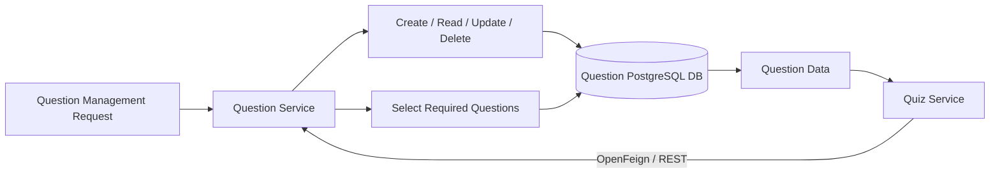

The service boundary keeps question-bank logic separate from quiz lifecycle logic.

---

## 🔗 OpenFeign Inter-Service Communication

The Quiz Service includes Spring Cloud OpenFeign to make synchronous service-to-service calls.

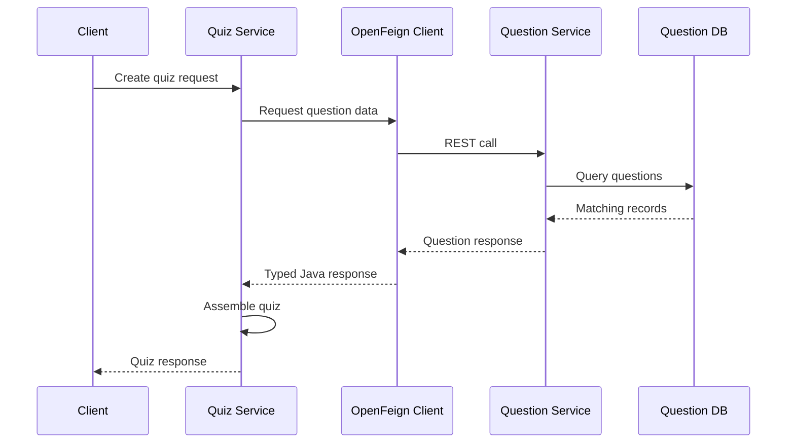

### Why OpenFeign?

Instead of manually writing repeated low-level HTTP client code, a declarative client can describe the remote API contract.

Conceptually:

```java
@FeignClient(name = "questionService")
public interface QuestionClient {

    // Remote question-service API contract

}
```

The Quiz Service can then work with Java methods while Feign performs the HTTP communication.

---

## 🗄️ Data Ownership

The current repository configures separate PostgreSQL connections for the two business services.

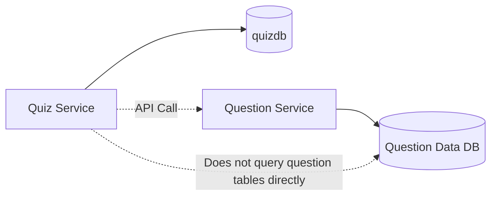

### Microservice Data Rule

> A service should own its data and expose capabilities through APIs rather than allowing another service to directly depend on its tables.

This prevents tight database coupling between Quiz Service and Question Service.

---

## 🔄 Quiz Creation Workflow

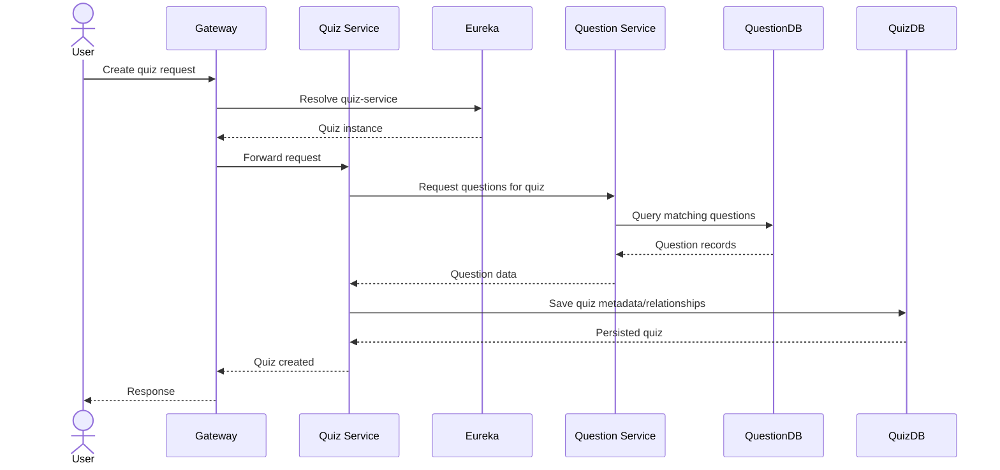

---

## 📖 Quiz Retrieval Workflow

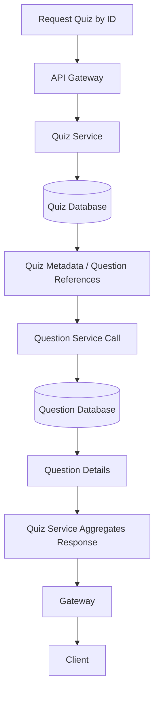

This is an example of **API composition**: one service orchestrates a response that depends on another service's owned data.

---

## 📝 Quiz Submission & Evaluation Flow

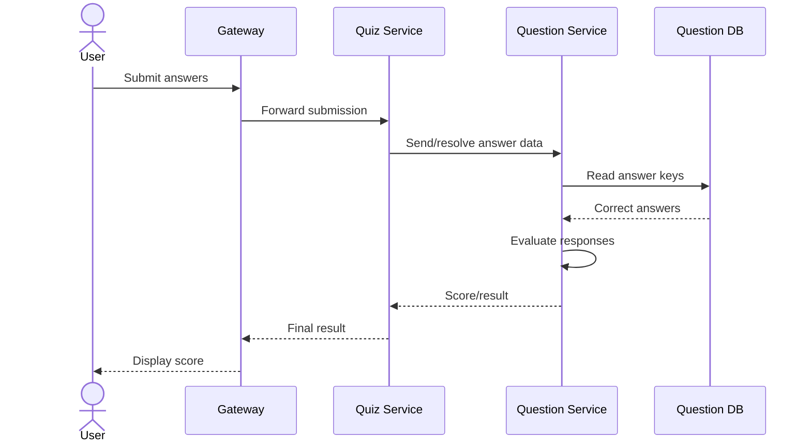

This flow illustrates why domain ownership matters: answer validation belongs close to question data, while the Quiz Service coordinates the user-facing quiz workflow.

---

## 🌐 Synchronous Communication Model

This project uses REST-based synchronous communication.

```text
Client
   ↓
API Gateway
   ↓
Quiz Service
   ↓
OpenFeign
   ↓
Question Service
   ↓
PostgreSQL
   ↑
Response travels back through the chain
```

### Advantages

- easy request-response reasoning,
- straightforward debugging,
- simple API contracts,
- immediate responses.

### Trade-offs

- downstream latency affects upstream latency,
- downstream outages can break dependent workflows,
- retries must be controlled,
- timeouts and circuit breakers become important as the system grows.

---

## 📂 Monorepo Structure

```text
Quiz-MicroServices/
│
├── api-gateway/          # Spring Cloud Gateway
├── eureka-server/        # Service discovery server
├── quiz-service/         # Quiz domain + orchestration
├── questionService/      # Question domain and persistence
├── frontend/             # React + Vite client
└── README.md
```

> The repository's existing overview refers to the discovery component as `eureka-server`; the actual Question Service directory uses the `questionService` naming style.

---

## 🛠️ Technology Stack

### Backend & Infrastructure

| Technology | Usage |
|---|---|
| Java 17 | Backend language |
| Spring Boot | Independent service applications |
| Spring Web | REST APIs |
| Spring Data JPA | Persistence abstraction |
| Spring Cloud Netflix Eureka | Service registration and discovery |
| Spring Cloud Gateway | Centralized request routing |
| Spring Cloud OpenFeign | Declarative inter-service REST calls |
| PostgreSQL | Relational persistence |
| Lombok | Boilerplate reduction |
| Maven | Build and dependency management |

### Frontend

| Technology | Usage |
|---|---|
| React | Client UI |
| Vite | Development server and build tooling |

---

## 🔌 Ports & Service Names

| Component | Verified/Documented Value |
|---|---|
| Eureka Server | `8761` |
| API Gateway | `8765` |
| Quiz Service | `8090` |
| Quiz Service Name | `quiz-service` |
| Question Service Name | `questionService` |
| Gateway Public Prefix | `/quiz-service/**` |

> Keep service-name casing consistent. Eureka client names, Feign client names, and gateway logical routes should refer to the intended registered application identity.

---

## ▶️ Recommended Startup Order

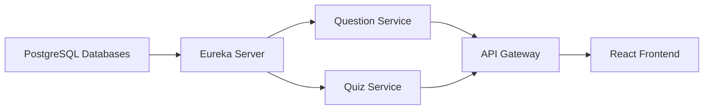

Recommended sequence:

1. Start PostgreSQL and ensure the required databases exist.
2. Start Eureka Server.
3. Start Question Service.
4. Start Quiz Service.
5. Confirm both services are registered in Eureka.
6. Start API Gateway.
7. Start the React frontend.
8. Send client requests through the gateway instead of bypassing it.

---

## 🚀 Local Development Setup

### Prerequisites

- Java 17+
- Maven
- PostgreSQL
- Node.js and npm
- Git

### Clone

```bash
git clone https://github.com/ashrithBalaji456/Quiz-MicroServices.git
cd Quiz-MicroServices
```

### Prepare PostgreSQL

The checked-in service configurations currently reference:

```text
Quiz Service DB: quizdb
Question Service DB URL: Ecom
```

Create the required databases or update the datasource URLs for your local environment.

### Start Eureka

```bash
cd eureka-server
./mvnw spring-boot:run
```

### Start Question Service

```bash
cd questionService
./mvnw spring-boot:run
```

### Start Quiz Service

```bash
cd quiz-service
./mvnw spring-boot:run
```

### Start API Gateway

```bash
cd api-gateway
./mvnw spring-boot:run
```

### Start Frontend

```bash
cd frontend
npm install
npm run dev
```

On Windows, use:

```powershell
mvnw.cmd spring-boot:run
```

---

## 🧪 Testing the Distributed Workflow

A useful test sequence is:

1. Open the Eureka dashboard.
2. Verify `quiz-service` is registered.
3. Verify `questionService` is registered.
4. Create or seed question records.
5. Call Quiz Service through the gateway.
6. Verify gateway route matching.
7. Verify Quiz Service logs show the incoming request.
8. Verify Question Service receives the inter-service call.
9. Verify Question Service queries its database.
10. Verify the response returns to Quiz Service.
11. Verify Quiz Service aggregates or persists the quiz workflow.
12. Verify the final response returns through the gateway.

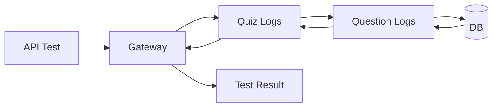

---

## 🚨 Failure Scenarios

| Failure | Effect | Recommended Improvement |
|---|---|---|
| Eureka unavailable at startup | Discovery may fail | Health checks and resilient startup |
| Question Service unavailable | Quiz workflow depending on it fails | Circuit breaker + timeout |
| PostgreSQL unavailable | Owning service persistence fails | Health/readiness probes |
| Feign call times out | Quiz request latency increases/fails | Timeouts + controlled retry |
| Gateway unavailable | Public API entry unavailable | Multiple gateway instances |
| Invalid route prefix | Gateway returns route error/404 | API documentation and contract tests |

---

## 🛡️ Recommended Resilience Evolution

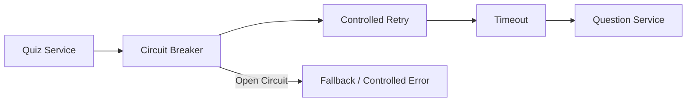

Recommended additions:

- Resilience4j circuit breaker,
- explicit connect/read timeouts,
- bounded retries,
- fallback responses where meaningful,
- correlation IDs,
- centralized logs,
- Actuator health endpoints,
- Prometheus metrics,
- OpenTelemetry tracing.

---

## 🔭 Observability Design

A distributed request should be traceable across services:

```text
traceId=7f91...
    │
    ├── API Gateway
    │      ↓
    ├── Quiz Service
    │      ↓ OpenFeign
    └── Question Service
           ↓
        PostgreSQL
```

Recommended production stack:

- Spring Boot Actuator,
- Micrometer,
- Prometheus,
- Grafana,
- OpenTelemetry,
- centralized structured logs.

---

## 🔐 Security Roadmap

The current project focuses on microservice communication and routing. A natural next architecture step is security.

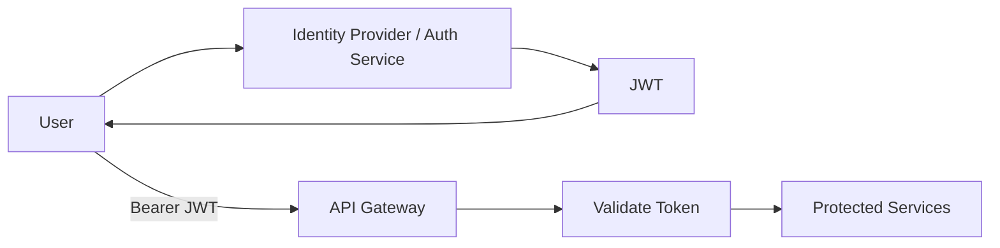

Recommended security improvements:

- OAuth2/OIDC or JWT authentication,
- gateway-level route protection,
- role-based authorization,
- secure secrets management,
- no database credentials in Git,
- HTTPS in deployed environments,
- input validation,
- rate limiting.

---

## ⚠️ Configuration Hygiene

The repository currently contains local PostgreSQL usernames/passwords in application configuration. For portfolio and deployment quality, externalize them:

```properties
spring.datasource.url=${DB_URL}
spring.datasource.username=${DB_USER}
spring.datasource.password=${DB_PASSWORD}
```

Example local environment:

```env
DB_URL=jdbc:postgresql://localhost:5432/quizdb
DB_USER=postgres
DB_PASSWORD=your_local_password
```

Do not commit real production credentials.

---

## 📈 Scalability Story

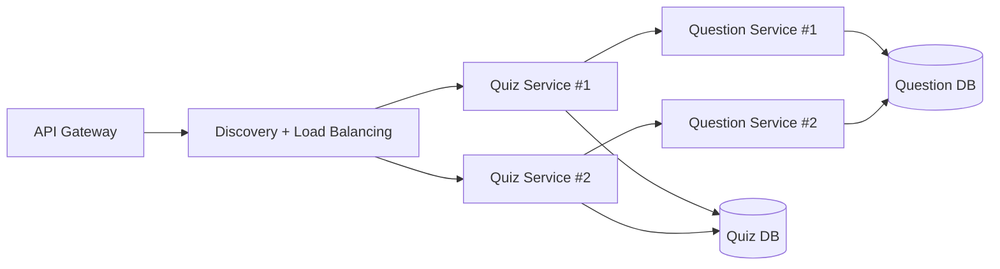

Service discovery and logical routing provide the foundation for adding more service instances without changing the public client URL.

---

## 🧠 Design Patterns Demonstrated

- Microservices Architecture
- API Gateway Pattern
- Service Registry Pattern
- Service Discovery
- Database-per-Service Principle
- API Composition
- Orchestration
- Declarative REST Client
- Layered Architecture inside services
- Synchronous Request-Response Communication
- Monorepo Organization for Multiple Services

---

## 🎓 What This Project Demonstrates

This project is valuable for backend interviews because it gives practical examples for explaining:

- why microservices need service discovery,
- how a gateway differs from a service registry,
- why the client should not know every service URL,
- how `lb://service-name` routing works,
- how OpenFeign simplifies inter-service calls,
- why one microservice should not directly access another service's database,
- how distributed requests fail,
- where circuit breakers and timeouts belong,
- and how a monorepo can still contain independently runnable services.

---

## 🗺️ Future Enhancements

- [ ] Spring Security
- [ ] OAuth2/OIDC or JWT authentication
- [ ] Role-based access for admin and quiz participants
- [ ] Dockerfiles for every service
- [ ] Docker Compose for complete local startup
- [ ] Spring Cloud Config Server
- [ ] Resilience4j circuit breakers
- [ ] Explicit Feign timeouts
- [ ] Retry policies
- [ ] Centralized exception response format
- [ ] Spring Boot Actuator
- [ ] OpenAPI/Swagger documentation
- [ ] Distributed tracing with OpenTelemetry
- [ ] Prometheus + Grafana monitoring
- [ ] Centralized logging
- [ ] Testcontainers integration tests
- [ ] Consumer-driven contract testing
- [ ] GitHub Actions CI/CD
- [ ] Kubernetes deployment manifests
- [ ] Redis caching for frequently accessed quizzes
- [ ] Kafka-based quiz analytics events
- [ ] Leaderboard Service
- [ ] User/Profile Service
- [ ] Notification Service
- [ ] Quiz attempt history
- [ ] Difficulty-based question selection
- [ ] Category-based random quiz generation

---

## 📂 Repository

| Component | Repository |
|---|---|
| 🧠 Complete Quiz Microservices Monorepo | [Quiz-MicroServices](https://github.com/ashrithBalaji456/Quiz-MicroServices) |

---

## 👨‍💻 Author

**Ashrith Balaji Gudla**

Java Backend / Spring Boot / Microservices Developer

- LinkedIn: https://www.linkedin.com/in/ashrith-balaji-gudla-5768302a8/
- GitHub: https://github.com/ashrithBalaji456

---

## ⭐ Support

If this project helps you understand Spring Boot microservices, service discovery, API gateways, or OpenFeign communication, consider starring the repository.

<div align="center">

### Built with ☕ Java • 🌱 Spring Boot • ☁️ Spring Cloud • 🔎 Eureka • 🚪 API Gateway • 🔗 OpenFeign • 🐘 PostgreSQL

**Discover services. Route centrally. Communicate cleanly. Scale independently.**

</div>
